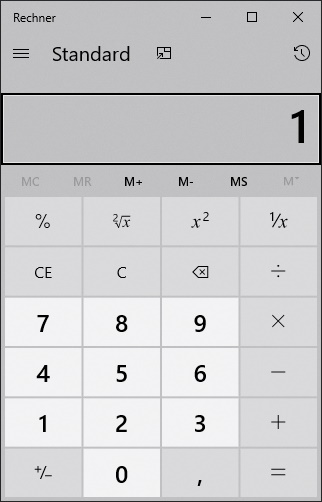

# BitmapCompare

[](https://app.codacy.com/gh/Codeuctivity/System.Drawing.Compare?utm_source=github.com&utm_medium=referral&utm_content=Codeuctivity/System.Drawing.Compare&utm_campaign=Badge_Grade_Dashboard) [](https://ci.appveyor.com/project/stesee/system-drawing-compare/branch/master) [](https://www.nuget.org/packages/BitmapCompare/)

What does BitmapCompare do? It compares images

Inspired by the image compare feature "Visual verification API" of [TestApi](https://blogs.msdn.microsoft.com/ivo_manolov/2009/04/20/introduction-to-testapi-part-3-visual-verification-apis/) this code supports comparing images by using a tolerance mask image. That tolerance mask image is a valid image by itself and can be manipulated.

BitmapCompare focus on OS independent support and depends on System.Drawing. It is planned to be semi compatible with [ImageSharp.Compare](https://github.com/Codeuctivity/ImageSharp.Compare). Expect different error values when using lossy compression formats, lossless formats result in same errors for now. BitmapCompare was created because ImageSharp changed their license to AGPL.

## Example show case

Imagine two images you want to compare, and want to accept the found difference as at state of allowed difference.

### Reference Image


### Actual Image



### Tolerance mask image

using "compare.CalcDiff" you can calc a diff mask from actual and reference image

Example - Create difference image

```csharp
            using var maskImage = Compare.CalcDiffMaskImage(pathPic1, pathPic2);
            maskImage.Save("differenceMask.png");
```


Example - Compare two images using the created difference image. Add white pixels to  differenceMask.png where you want to allow difference.

```csharp
var maskedDiff = Compare.CalcDiff(pathPic1, pathPic2, "differenceMask.png");
Assert.That(maskedDiff.AbsoluteError, Is.EqualTo(0));
```

Now you can change differenceMask.png with your favorite editor and paint white pixels where you want to ignore difference in your image under test.
